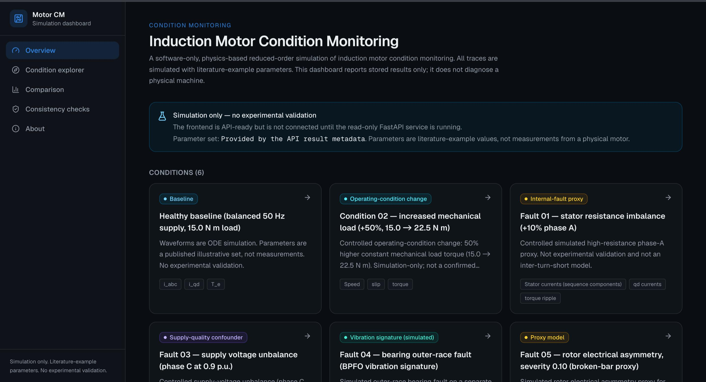
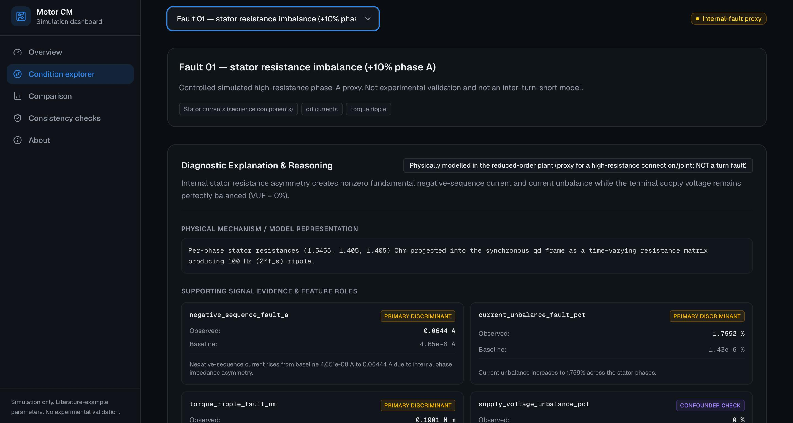
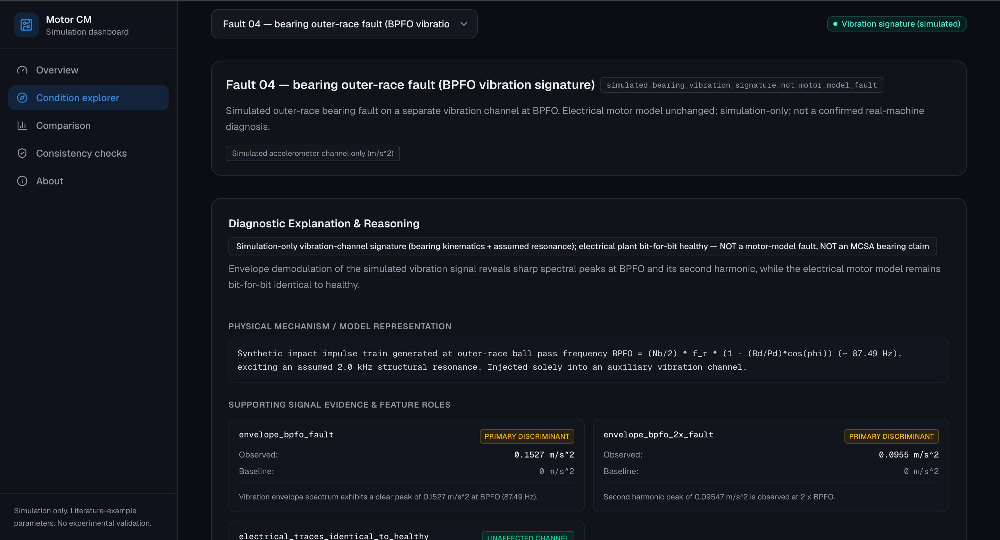
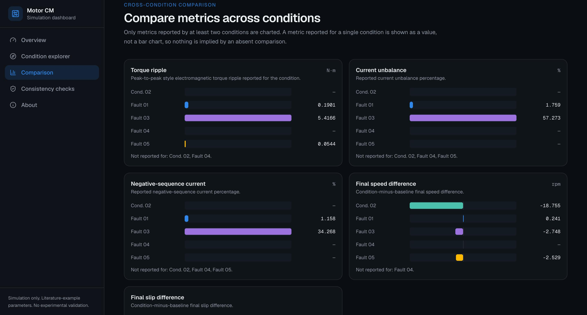
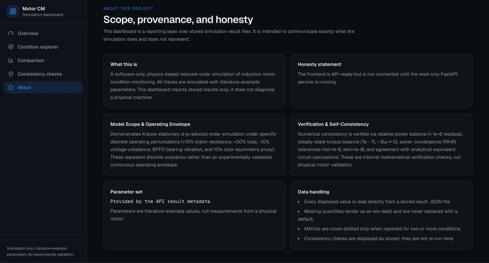

# Induction Motor Condition Monitoring Dashboard

A Next.js dashboard for interactive exploration, cross-condition comparison, and deterministic diagnostic reasoning over a physics-based reduced-order induction motor simulation.

**Live dashboard:** https://motor-simulation-data-comparison-8tpf-pi94csi9y.vercel.app

**Backend API:** https://induction-motor-condition-monitoring.onrender.com

**Backend repository:** https://github.com/ayaankabir/induction-motor-condition-monitoring

---

## Project Overview

This project demonstrates software-only induction motor condition monitoring using a reduced-order physics-based simulation and stored simulation results.

The dashboard does not simulate a physical motor in the browser and does not claim experimental machine diagnosis. The deployed frontend is a read-only reporting layer over a FastAPI service that serves stored JSON result files.

The model uses a classical stationary-reference-frame Krause d-q formulation with an illustrative 4 kW, 400 V, 50 Hz, 4-pole induction motor parameter set.

---

## Simulated Conditions

The project contains six stored conditions:

1. **Healthy baseline**
   - Balanced 50 Hz supply
   - 15.0 N·m mechanical load

2. **Increased mechanical load**
   - 50% increase in load torque
   - Treated as an operating-condition change rather than an internal fault

3. **Stator resistance imbalance**
   - +10% phase-A stator resistance
   - Controlled high-resistance phase-A proxy

4. **Supply voltage unbalance**
   - Phase-C supply voltage reduced by 10%
   - Treated as a supply-quality confounder rather than an internal motor fault

5. **Bearing outer-race condition**
   - Simulated BPFO vibration signature
   - Generated on a separate auxiliary vibration channel
   - Electrical motor model remains unchanged

6. **Rotor electrical asymmetry**
   - 10% rotor electrical asymmetry proxy
   - Intended as a broken-bar-inspired proxy rather than a complete broken-bar model

---

## Diagnostic Discrimination

The dashboard uses multiple signal domains rather than relying on a single electrical metric.

### Stator resistance imbalance vs. supply voltage unbalance

Both conditions can produce negative-sequence current and torque ripple. The diagnostic reasoning therefore checks supply-voltage sequence components alongside current-based evidence.

### Increased load vs. internal asymmetry

An increased mechanical load primarily changes operating-point quantities such as slip, speed and fundamental current magnitude, while the internal asymmetry scenarios introduce additional imbalance signatures.

### Rotor electrical asymmetry

The simulated rotor asymmetry produces characteristic sideband behavior around the stator-current fundamental together with a small torque-ripple signature.

### Bearing outer-race condition

The bearing scenario is represented through a separate simulated vibration channel. Envelope analysis exposes the BPFO component and its harmonic while the electrical motor traces remain identical to the healthy baseline.

---

## Signal Analysis

The project includes reusable spectral-analysis functionality for:

- FFT-based spectral features
- Envelope analysis
- Bearing BPFO-related features
- Rotor-asymmetry sideband features
- Cross-condition metric comparison

The dashboard exposes the resulting stored metrics and the physical reasoning behind the diagnostic classification.

---

## Verification & Consistency

The repository includes automated tests and engineering consistency checks covering the simulation, analysis, reporting and API layers.

Key checks include:

- **Solver convergence:** SciPy RK45 integration with `rtol = 1e-6` and `atol = 1e-8`
- **Power balance:** relative residuals below `1e-6` across the checked electrical runs
- **Steady-state torque balance:** `Te - TL - Bω ≈ 0`
- **Analytical benchmark:** checked healthy-baseline torque and RMS current agree with the corresponding equivalent-circuit calculations within 0.001%
- **Automated test suite:** backend simulation, analysis, reporting and API tests
- **Frontend validation:** TypeScript compilation and production build

These are mathematical and software consistency checks, not experimental validation against a physical motor.

---

## Engineering Decisions

### Reduced-order ODE instead of FEM

The reduced-order differential-equation model provides a computationally lightweight way to study cause-and-effect relationships without the complexity of finite-element electromagnetic simulation.

### Deterministic diagnostic reasoning instead of black-box ML

The diagnostic layer uses explicit physics-grounded rules and signal features rather than probabilistic models or neural networks. This keeps the reasoning inspectable and reproducible.

### Separate vibration channel

The bearing scenario uses a dedicated simulated vibration channel rather than attempting to represent microscopic bearing-contact dynamics inside the low-frequency electrical motor model.

### Read-only dashboard architecture

The frontend is a Next.js application deployed on Vercel. It communicates with a read-only FastAPI service deployed on Render.

```text
Stored simulation results
        │
        ▼
  FastAPI / Render
        │
        │ JSON
        ▼
 Next.js / Vercel
        │
        ▼
 Interactive dashboard
---

## Dashboard Screenshots

### Overview



### Fault 01 — Stator Resistance Imbalance



### Fault 04 — Bearing Outer-Race Analysis



### Cross-Condition Comparison



### About & Scope


